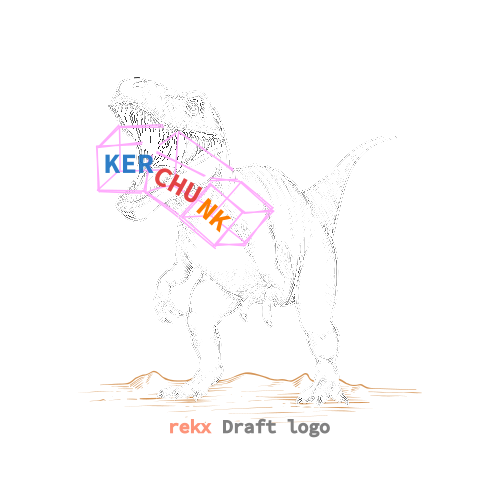

---
tags:
  - NetCDF
  - Time Series
  - Kerchunk
  - Python
---

# rekx 🦖

{ align=right }[^*]

[^*]: <a href="https://www.freepik.com/free-vector/hand-drawn-dinosaur-outline-illustration_58593460.htm#query=trex&position=47&from_view=search&track=sph&uuid=27caf12e-35ea-47ad-a113-2d4f5981f58f">Original T-Rex drawn by pikisuperstar</a> on Freepik

**[ Under Development ]**

`rekx` interfaces the [Kerchunk](https://fsspec.github.io/kerchunk/) library
in an interactive way through the command line.
It assists in creating virtual aggregate datasets,
also known as Kerchunk reference sets,
enabling efficient, parallel and cloud-friendly in-situ data access
without duplicating original datasets.

More than a functional tool,
`rekx` serves an educational purpose on matters around
chunking, compression and reading data from file formats such as NetCDF
that are widely adopted by the scientific community
for storing and processing large time series.
It features command line tools
to diagnose data structures,
validate chunking uniformity across multiple files,
suggest good chunking shapes and parameterise the rechunking of datasets,
create and aggregate Kerchunk reference sets
and time data read operations.
